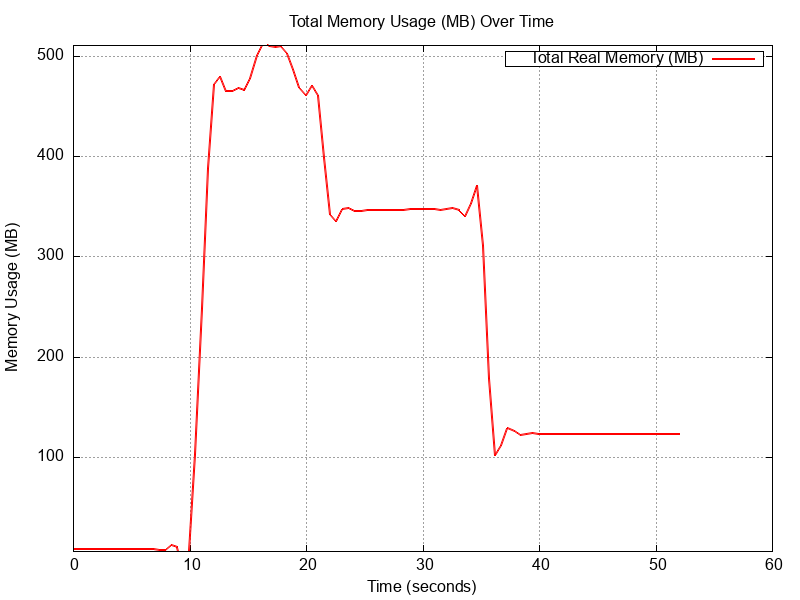
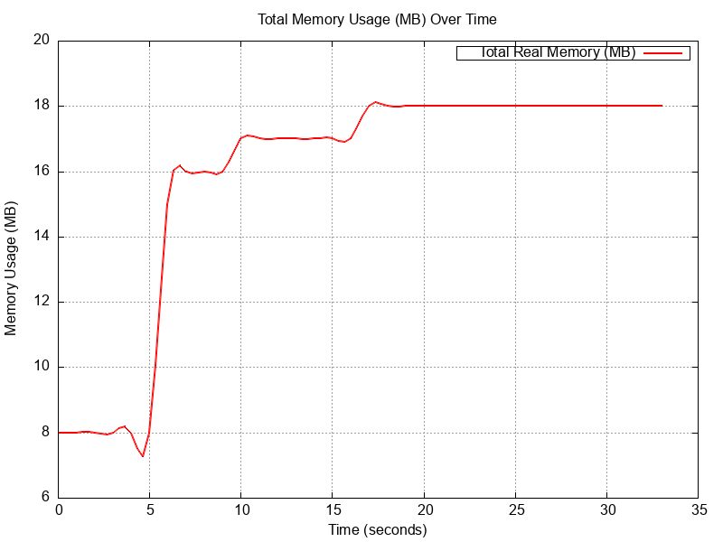

# Benchmark: Optimized JSON Streaming vs. Full JSON Loading

This document presents a **memory usage** benchmark comparing two approaches to handling large JSON payloads:

1. **Optimized JSON Streaming** – Parses JSON **incrementally** without loading it entirely into memory.
2. **Full JSON Loading** – Reads the entire JSON request into memory before processing.

I'm using [`gnuplot`](http://www.gnuplot.info/) for plotting the graphs.

## Optimized JSON Streaming Strategy

The **optimized approach** reads airports **one by one**, processing them **without fully loading the JSON** into memory.

See [HandleUpsert](handlers/v1/airports/airports.go):

```go
// HandleUpsert handles the upsert of airports in a streaming fashion.
func (h *handlers) HandleUpsert(w http.ResponseWriter, r *http.Request) {
	ctr := newHttpResponseController(w)
	bufReader := bufio.NewReaderSize(r.Body, maxBufferedReaderSize)
	dec := json.NewDecoder(bufReader)
	// check for opening '['.
	if err := h.readExpectedToken(dec, json.Delim('[')); err != nil {
		web.RespondWithError(w, http.StatusBadRequest, "invalid JSON: expected '[' at start")
		return
	}
	// process each airpot in the JSON object.
	if herr := h.processAirports(r.Context(), dec); herr != nil {
		web.RespondWithError(w, herr.code, herr.Error())
		return
	}
	// check for closing ']'.
	if err := h.readExpectedToken(dec, json.Delim(']')); err != nil {
		web.RespondWithError(w, http.StatusBadRequest, "invalid JSON: expected ']' at end")
		return
	}
	// flush response and finalize.
	if err := ctr.Flush(); err != nil {
		web.RespondWithError(w, http.StatusInternalServerError, err.Error())
		return
	}
	web.RespondAfterFlush(w, UpsertAirportResponse{Message: "airports upserted"})
}
```

### Advantages:
- Memory **stays low**, as only **one airport** is loaded at a time.
- No large allocations reduce **GC pressure**.
- Processing starts **immediately**, reducing latency.

---

## Full JSON Loading Strategy

The **naive approach loads the entire JSON** into memory before processing.

See [HandleNonStreamingUpsert](handlers/v1/airports/nonstreaming.go):

```go
// HandleNonStreamingUpsert handles the upsert of airports by reading the entire JSON array into memory.
func (h *handlers) HandleNonStreamingUpsert(w http.ResponseWriter, r *http.Request) {
	// read full request body into memory.
	body, err := ioReadAll(r.Body)
	if err != nil {
		web.RespondWithError(w, http.StatusBadRequest, "failed to read request body")
		return
	}
	var airportsToBeUpserted []UpsertAirportRequest
	if err := jsonUnmarshal(body, &airportsToBeUpserted); err != nil {
		web.RespondWithError(w, http.StatusBadRequest, "invalid JSON format")
		return
	}
	for _, request := range airportsToBeUpserted {
		if err := validate.Check(request); err != nil {
			web.RespondWithError(w, http.StatusBadRequest, err.Error())
			return
		}
		if err := upsertAirport(r.Context(), h.db, request.ToAirport()); err != nil {
			web.RespondWithError(w, http.StatusInternalServerError, errors.Wrap(err, "error upserting airport").Error())
			return
		}
	}
	web.Respond(w, http.StatusOK, UpsertAirportResponse{Message: "airports upserted"})

	// manually trigger garbage collection to free up memory.
	runtime.GC()
	debug.FreeOSMemory()
}
```

### Disadvantages:
- **Memory spikes** due to loading **all** airports at once.
- Can cause **out-of-memory (OOM) crashes** on large inputs.
- **Slower processing** as nothing starts until **all JSON is read**.

---

# Benchmarking Steps

[benchmark folder](benchmark)

### 1️ Generate Large JSON Data
First, generate **1 million airports**:

```sh
$ ./json_gen.sh 1000000 big_airports.json
Generating 1000000 ports in big_airports.json...
Generation completed. File saved as big_airports.json
```

### 2️ Start the API Server
Run the optimized `HandleUpsert`:

```sh
$ make run PORT=4444
{"time":"2025-02-23T15:22:37.01061-03:00","level":"INFO","msg":"API listening on :4444"}
```

### 3 Collect Memory Usage Data
Record memory usage over time:

```sh
$ ./collect_mem_metrics.sh mem_metrics.csv
```

### 4 Measure Request Time
Execute the API call using `curl`:

```sh
curl -v "http://localhost:4444/api/v1/airports" -H "Content-Type: application/json" --data-binary @big_airports.json
```

### 5 check the inserted/upserted airports in db

```
$ sqlite3 db/airportsRestApi.db "SELECT count(*) FROM airports;"
1000000
```

### 6 Generate Graphs
Plot the memory usage comparison:

```sh
$ ./generate_mem_metrics_graph.sh mem_metrics.csv memgraph.png
```

---

# Benchmark Results

## Memory Consumption

| Method                     | Peak Memory Usage (MB) |
|----------------------------|-----------------------|
| **Full JSON Loading**       | **>500 MB**          |
| **Optimized Streaming**     | **~18 MB**           |

**Streaming kept memory under 18MB, while full loading exceeded 500MB.**

---

# Plotted Graphs

## Full JSON Loading (High Memory Usage)


## Optimized Streaming (Low Memory Usage)


---

# Conclusion

- **Full JSON Loading** **caused high memory usage**, long processing times, and potential OOM crashes.
- **Optimized Streaming** significantly **reduced memory consumption** and **improved processing speed**.
- **Use JSON streaming** for large payloads **to ensure stability and efficiency** in production.
