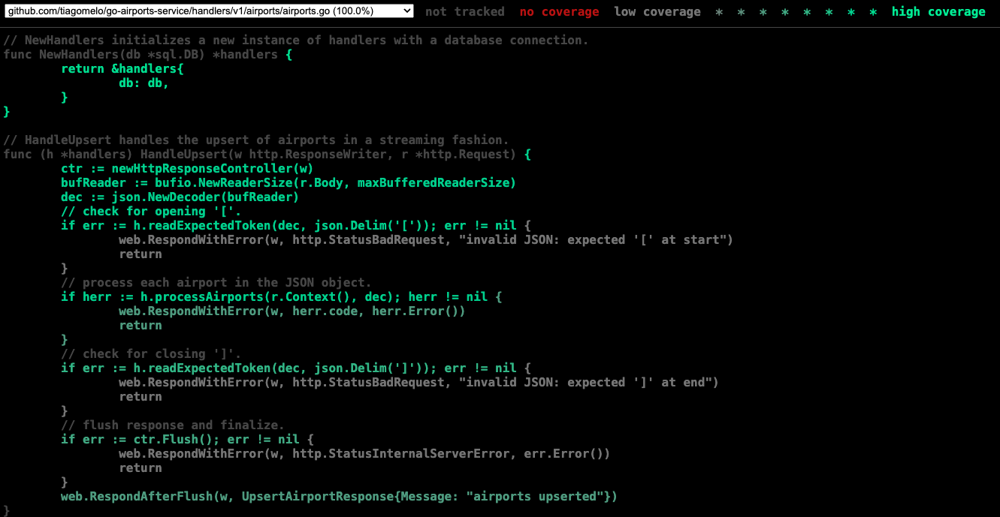

# go-airports-service


A RESTful api written in [Go](https://go.dev) for upserting Airports.

It aims to compare memory consumption between streaming and non-streaming styles in endpoints.

## key features

- I've generated the basic REST API structure using an open source project of mine, [go-templates](https://github.com/tiagomelo/go-templates).
- Uses [SQLite](https://www.sqlite.org/) for saving Airports in disk.
- Uses [Gorilla Mux](https://github.com/gorilla/mux) for HTTP routing.
- Implements custom middleware.
- Input validation with [validator](https://github.com/go-playground/validator).
- Database migrations handled by [golang-migrate](https://github.com/golang-migrate/migrate).
- Ensures 100% test coverage, including both unit and integration tests.

## benchmark

Visit [benchmark](./BENCHMARK.md) for more info.

## endpoints

**`POST api/v1/airports`**

This endpoint receives a JSON object containing multiple airports entries. It processes the input **streaming-style** for efficiency, ensuring that even large files do not exhaust memory.

Sample input:

```
[
    {
        "name": "Hartsfield Jackson Atlanta Intl",
        "city": "Atlanta",
        "country": "United States",
        "iata_code": "ATL",
        "geoloc": {
            "lat": 33.636719,
            "lng": -84.428067
        }
    },
    {
        "name": "Chicago Ohare Intl",
        "city": "Chicago",
        "country": "United States",
        "iata_code": "ORD",
        "geoloc": {
            "lat": 41.978603,
            "lng": -87.904842
        }
    }
]
```

output:

```
{"message":"airports upserted"}
```

**`POST api/v1/nonstreaming/airports`**

This endpoint handles the upsert of airports by reading the entire JSON array into memory.

Input and output are the same from above.

## running it

```
make run PORT=<desired_port>
```

### calling the streaming endpoint via cURL

You can use the provided [airports.json](airports.json).

```
$ time curl -v "http://localhost:4444/api/v1/airports" -H "Content-Type: application/json" --data-binary @airports.json 
* Host localhost:4444 was resolved.
* IPv6: ::1
* IPv4: 127.0.0.1
*   Trying [::1]:4444...
* Connected to localhost (::1) port 4444
> POST /api/v1/airports HTTP/1.1
> Host: localhost:4444
> User-Agent: curl/8.7.1
> Accept: */*
> Content-Type: application/json
> Content-Length: 375656
> 
* upload completely sent off: 375656 bytes
< HTTP/1.1 200 OK
< Vary: Accept-Encoding
< Date: Wed, 26 Feb 2025 13:45:03 GMT
< Transfer-Encoding: chunked
< 
* Connection #0 to host localhost left intact
{"message":"airports upserted"}
real	0m0.103s
user	0m0.006s
sys	0m0.007s
```

The `--data-binary` flag ensures that data is sent exactly as it is, without modifications, making it ideal for streaming large JSON payloads. Unlike `--data`, which may alter line breaks or spaces, `--data-binary` preserves the original structure, preventing unwanted formatting issues. This is especially useful for APIs that process bulk data or real-time streams, ensuring the request is handled as a continuous, unmodified data stream.

### calling the non-streaming endpoint via cURL

```
$ time curl -v -X POST "http://localhost:4444/api/v1/nonstreaming/airports" -H "Content-Type: application/json" -d @airports.json
Note: Unnecessary use of -X or --request, POST is already inferred.
* Host localhost:4444 was resolved.
* IPv6: ::1
* IPv4: 127.0.0.1
*   Trying [::1]:4444...
* Connected to localhost (::1) port 4444
> POST /api/v1/nonstreaming/airports HTTP/1.1
> Host: localhost:4444
> User-Agent: curl/8.7.1
> Accept: */*
> Content-Type: application/json
> Content-Length: 355962
> 
* upload completely sent off: 355962 bytes
< HTTP/1.1 200 OK
< Content-Type: application/json
< Vary: Accept-Encoding
< Date: Wed, 26 Feb 2025 13:44:23 GMT
< Content-Length: 31
< 
* Connection #0 to host localhost left intact
{"message":"airports upserted"}
real	0m0.143s
user	0m0.008s
sys	0m0.008s
```

## running tests

```
make test
```

## coverage report

```
make coverage
```

then, the coverage report will be opened in your browser:



## available `Makefile` targets

```
$ make help
Usage: make [target]

  help                    shows this help message
  test                    run tests
  coverage                run tests and generate coverage report in html format
  migrate-setup           installs golang-migrate
  create-migration        creates up and down migration files for a given name (make create-migrations NAME=<desired_name>)
  migrate-up              runs up N migrations, N is optional (make migrate-up N=<desired_migration_number>)
  migrate-down            runs down N migrations, N is optional (make migrate-down N=<desired_migration_number>)
  migrate-to-version      migrates to version V (make migrate-to-version V=<desired_version>)
  migrate-force-version   forces version V (make migrate-force-version V=<desired_version>)
  migrate-version         checks current database migrations version
  migrate-test-up         runs up N migrations on test db, N is optional (make migrate-up N=<desired_migration_number>)
  migrate-test-down       runs down N migrations on test db, N is optional (make migrate-down N=<desired_migration_number>)
  run                     runs the API
```

## references

1. Personal website: https://tiagomelo.info/
2. Linkedin: https://www.linkedin.com/in/tiagocmelo/
3. Github: https://github.com/tiagomelo